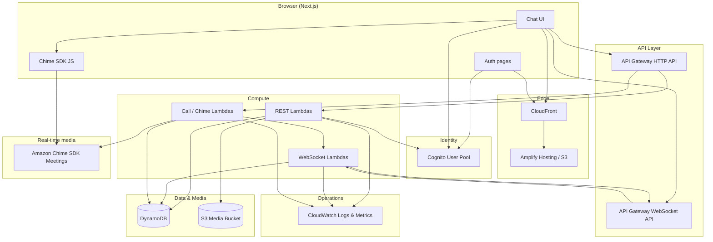
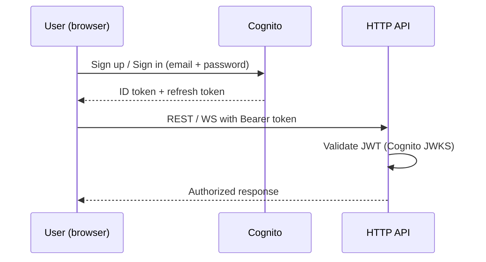
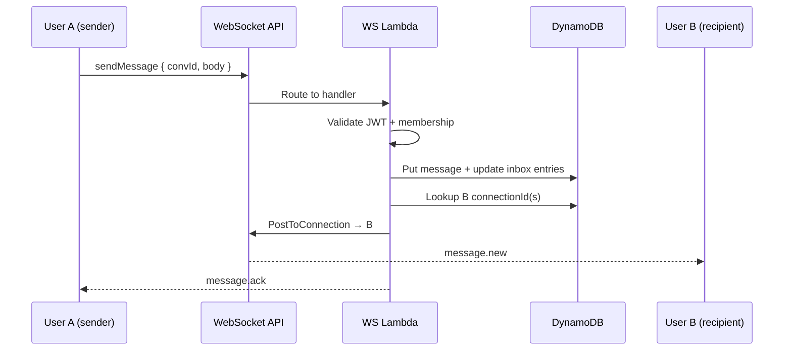
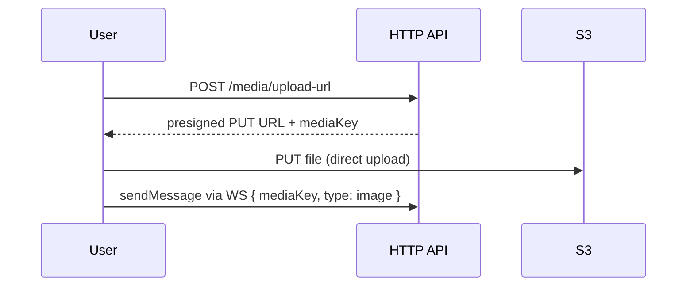
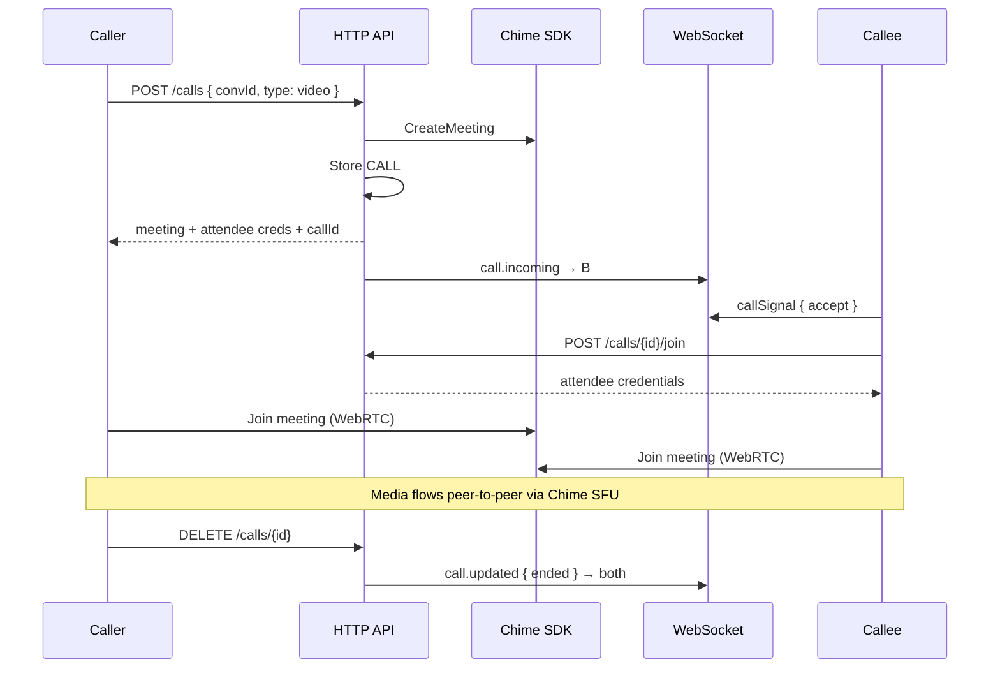

# Phase 2 — Architecture

**Project:** AmioChat  
**Version:** 0.3  
**Last updated:** 2026-06-18  
**Status:** Approved (D3 updated to Terraform)  
**Prerequisite:** [Phase 1 — Requirements](./phase-1-requirements.md) (approved)

---

## 1. Executive summary

AmioChat MVP is a **serverless, event-driven** web application in **us-east-1**. The browser client talks to **REST APIs** for CRUD operations and a **WebSocket API** for real-time chat, presence, typing indicators, and call signaling. **Amazon Chime SDK** handles voice/video media. **Amazon Cognito** manages authentication. **DynamoDB** is the system of record; **S3** stores media.

This document resolves the three open Phase 1 decisions (D1–D3), defines the AWS service map, data model, and key flows, and sets the foundation for Phase 3 (detailed design).

---

## 2. Architecture decisions (D1–D3)

| ID | Decision | Choice | Rationale |
|----|----------|--------|-----------|
| **D1** | Real-time transport | **API Gateway WebSockets + Lambda** | Natural fit for bidirectional chat events (messages, typing, presence, call signaling). Full control over routing. Avoids GraphQL/AppSync learning curve for a small team. Scales to 5,000+ connections without redesign. |
| **D2** | Frontend framework | **Next.js 15 (App Router)** | SSR for auth pages (login, register, reset password). Client-heavy chat shell after login. Strong React ecosystem, easy deploy to Amplify Hosting. Cognito integrates cleanly via `aws-amplify` or `amazon-cognito-identity-js`. |
| **D3** | Infrastructure as Code | **Terraform (HCL)** | Team standard. Declarative IaC with explicit state; portable workflow. App code remains TypeScript; infra in `infra/terraform/`. |

See [§12 ADRs](#12-architecture-decision-records) for full decision records.

---

## 3. High-level architecture



---

## 4. AWS service map

| Concern | AWS service | Role in AmioChat |
|---------|-------------|------------------|
| **Static hosting** | Amplify Hosting (or S3 + CloudFront) | Serve Next.js app |
| **Authentication** | Cognito User Pool | Email/password sign-up, sign-in, JWT tokens, password reset |
| **REST API** | API Gateway HTTP API | Users, conversations, messages (history), media upload URLs, profile |
| **Real-time API** | API Gateway WebSocket API | Live messages, typing, presence, read receipts, call signaling |
| **Business logic** | AWS Lambda (Node.js 20, TypeScript) | All API and WebSocket handlers |
| **Primary database** | DynamoDB (on-demand) | Users, conversations, messages, connections, calls, presence |
| **Media storage** | S3 (private bucket) | Avatars, images, file attachments |
| **Media delivery** | S3 presigned URLs | Short-lived download access (SEC-04) |
| **Voice / video** | Amazon Chime SDK | 1:1 meetings; client SDK handles WebRTC media |
| **Email** | Amazon SES (via Cognito) | Verification and password-reset emails |
| **Secrets & config** | SSM Parameter Store | Non-secret config; Secrets Manager for sensitive keys if needed |
| **Observability** | CloudWatch Logs, Metrics, Alarms | Structured logs, dashboards, alerts (OPS-01, OPS-02) |
| **IaC** | Terraform | All infrastructure (OPS-03) — `infra/terraform/` |
| **CI/CD** | GitHub Actions → Terraform plan/apply | Phase 6; pipeline stub defined here |

### Not used in MVP (deferred)

| Service | Reason deferred |
|---------|-----------------|
| AppSync | WebSockets chosen (D1) |
| ElastiCache / Redis | DynamoDB + API GW connection table sufficient at MVP scale |
| ECS / EKS | Serverless-first; no long-running servers |
| SNS / Pinpoint push | Browser notifications only in MVP; mobile push in v2 |
| OpenSearch | Message search deferred to v1.x |
| AWS WAF | Add before public beta if abuse becomes a concern |

---

## 5. Component responsibilities

### 5.1 Frontend (Next.js)

| Module | Responsibility |
|--------|----------------|
| `app/(auth)/*` | Login, register, forgot-password (SSR) |
| `app/(chat)/*` | Main chat shell — sidebar, thread, composer (client components) |
| `lib/cognito` | Auth session, token refresh |
| `lib/api` | REST client with JWT |
| `lib/ws` | WebSocket client: connect, reconnect, heartbeat, event dispatch |
| `lib/chime` | Chime SDK meeting join/leave, device controls |
| `components/chat/*` | Message list, typing indicator, call UI |

### 5.2 Backend Lambda functions

Organized as a **monorepo package** (`packages/backend`) with shared types and DynamoDB access layer.

| Function group | Triggers | Responsibility |
|----------------|----------|----------------|
| **REST — Users** | HTTP API | Profile CRUD, user search by email |
| **REST — Conversations** | HTTP API | List conversations, get/create 1:1 conversation |
| **REST — Messages** | HTTP API | Paginated message history |
| **REST — Media** | HTTP API | Presigned upload/download URLs |
| **REST — Calls** | HTTP API | Create Chime meeting, end call (supplements signaling) |
| **WS — Connect** | `$connect` | Validate JWT, store `connectionId ↔ userId` in DynamoDB |
| **WS — Disconnect** | `$disconnect` | Remove connection; update presence |
| **WS — Default** | `$default` | Route incoming WS actions: `sendMessage`, `typing`, `read`, `callOffer`, `callAnswer`, `callEnd` |
| **WS — Authorizer** | (optional) | Lambda authorizer on connect using Cognito JWT |

### 5.3 Shared backend libraries

| Library | Purpose |
|---------|---------|
| `ddb` | Single-table access patterns, conditional writes |
| `auth` | JWT validation (Cognito JWKS) |
| `push` | Post to recipient's active WebSocket connection(s) via API Gateway Management API |
| `chime` | Create/delete meetings, attendee credentials |
| `validation` | Zod schemas for all inbound payloads |

---

## 6. Data model (DynamoDB single-table)

**Table name:** `AmioChat-{env}`  
**Billing:** On-demand (pay per request; cost-effective at MVP, scales to 5,000+ users)

### 6.1 Key design

| Entity | PK | SK | Attributes (summary) |
|--------|----|----|----------------------|
| User profile | `USER#<userId>` | `PROFILE` | email, displayName, avatarKey, createdAt |
| User inbox entry | `USER#<userId>` | `CONV#<convId>` | lastMessageAt, lastMessagePreview, unreadCount |
| Conversation meta | `CONV#<convId>` | `META` | participantIds[], createdAt, type=`direct` |
| Conversation member | `CONV#<convId>` | `MEMBER#<userId>` | joinedAt, lastReadAt |
| Message | `CONV#<convId>` | `MSG#<isoTime>#<msgId>` | senderId, type, body, mediaKey?, status |
| WebSocket connection | `USER#<userId>` | `CONN#<connectionId>` | connectedAt, ttl |
| Call session | `CALL#<callId>` | `META` | convId, callerId, calleeId, chimeMeetingId, status, startedAt |
| Presence | `USER#<userId>` | `PRESENCE` | status, lastSeenAt, ttl |

**1:1 conversation ID:** deterministic — `direct#<sortedUserId1>#<sortedUserId2>` so two users always share one conversation.

### 6.2 Global secondary indexes

| GSI | PK | SK | Use case |
|-----|----|----|----------|
| **GSI1-Email** | `EMAIL#<email>` | `USER#<userId>` | User search / lookup by email (CONT-01) |
| **GSI2-Messages** | `CONV#<convId>` | `MSG#<isoTime>#<msgId>` | Message history queries (same as base table SK; use if inverted pattern needed) |

*Note:* Base table SK sort key on `MSG#<time>#<id>` already supports chronological queries within a conversation. GSI2 is optional; include only if access patterns require it.

### 6.3 TTL

| Entity | TTL attribute | Purpose |
|--------|---------------|---------|
| `CONN#` | `expiresAt` | Auto-clean stale WebSocket connection records |
| `PRESENCE` | `expiresAt` | Mark offline if not refreshed (e.g. 5 min) |

### 6.4 S3 layout

```
amiochat-media-{env}/
  avatars/{userId}/{uuid}.{ext}
  attachments/{convId}/{msgId}/{filename}
```

- Bucket: private, SSE-S3, block public access
- Upload: presigned PUT (max 25 MB, validated content-type)
- Download: presigned GET (15 min expiry)

---

## 7. API surface (overview)

Detailed OpenAPI and WebSocket protocol specs are **Phase 3** deliverables. This section defines the contract boundary.

### 7.1 REST endpoints (HTTP API)

| Method | Path | Purpose |
|--------|------|---------|
| `GET` | `/users/me` | Current user profile |
| `PATCH` | `/users/me` | Update display name, avatar |
| `GET` | `/users/search?q=` | Search users by email |
| `GET` | `/conversations` | List user's conversations (inbox) |
| `POST` | `/conversations` | Create or get 1:1 conversation `{ participantId }` |
| `GET` | `/conversations/{id}/messages?cursor=` | Paginated message history |
| `POST` | `/media/upload-url` | Presigned PUT URL `{ convId, filename, contentType }` |
| `POST` | `/calls` | Initiate call `{ convId, type: voice\|video }` → returns Chime meeting + callId |
| `POST` | `/calls/{id}/join` | Join existing meeting → attendee credentials |
| `DELETE` | `/calls/{id}` | End call |

All endpoints require `Authorization: Bearer <Cognito ID token>`.

### 7.2 WebSocket actions (client → server)

| Action | Payload | Server behavior |
|--------|---------|-----------------|
| `sendMessage` | `{ convId, type, body?, mediaKey? }` | Persist message, push to recipient connection(s), ack sender |
| `typing` | `{ convId, isTyping }` | Push typing event to other participant |
| `read` | `{ convId, messageId }` | Update lastReadAt, push read receipt |
| `presence` | `{ status }` | Update presence record |
| `callSignal` | `{ callId, signal, payload }` | Relay signaling (ringing, accept, decline, end) to other party |

### 7.3 WebSocket events (server → client)

| Event | Payload |
|-------|---------|
| `message.new` | Full message object |
| `message.ack` | `{ clientMsgId, messageId, status }` |
| `typing` | `{ convId, userId, isTyping }` |
| `read` | `{ convId, userId, messageId }` |
| `presence` | `{ userId, status, lastSeenAt? }` |
| `call.incoming` | `{ callId, convId, callerId, type }` |
| `call.updated` | `{ callId, status }` |

---

## 8. Key data flows

### 8.1 Authentication



- Cognito User Pool with email verification
- Password policy: min 8 chars, mixed case, number
- Tokens stored in memory + httpOnly cookie for refresh (Phase 3 security detail)

### 8.2 Send message (real-time)



Offline recipient: message persisted in DynamoDB; delivered via WebSocket on reconnect. Unread count incremented on inbox entry.

### 8.3 Media upload



### 8.4 Video call



**Call signaling** uses WebSocket for low-latency ring/accept/decline. **Chime SDK** handles all audio/video media — no custom TURN/STUN in MVP.

---

## 9. Security architecture

| Layer | Control |
|-------|---------|
| **Transport** | TLS 1.2+ on CloudFront, API Gateway, WebSocket (SEC-01) |
| **Authentication** | Cognito JWT on every REST and WS `$connect` (SEC-02) |
| **Authorization** | Lambda verifies user is conversation member before read/write (SEC-03) |
| **Media** | Private S3; presigned URLs only (SEC-04) |
| **Input** | Zod validation on all handlers (SEC-05) |
| **Rate limiting** | API Gateway throttling (e.g. 100 req/s burst); WAF optional later (SEC-06) |
| **Secrets** | SSM Parameter Store; no secrets in git (SEC-07) |
| **CORS** | Restrict to Amplify/CloudFront domain per environment |
| **IAM** | Least-privilege per Lambda; no wildcard `*` on DynamoDB |

---

## 10. Environments & deployment topology

| Environment | Purpose | AWS account |
|-------------|---------|-------------|
| **dev** | Developer testing | Same account, isolated stacks |
| **staging** | Pre-production, load tests | Same account |
| **prod** | Beta users | Same account (separate stack); dedicated account optional later |

Each environment is a separate Terraform apply with `-var-file`:

```bash
terraform plan -var-file=environments/staging.tfvars
terraform apply -var-file=environments/prod.tfvars
```

Resources are tagged `Environment`, `Project`, `ManagedBy=Terraform`.

**Region:** `us-east-1` only for MVP (A9).

---

## 11. Scalability & reliability

| Requirement | How architecture addresses it |
|-------------|------------------------------|
| SCALE-01 (500 → 5,000 users) | API GW WebSocket supports 500K connections/account; Lambda concurrency scales; DynamoDB on-demand |
| SCALE-02 (100 msg/s) | Lambda parallel invocations; DynamoDB partition key per conversation avoids hot partitions at 1:1 scale |
| SCALE-03 (horizontal scale) | Fully serverless — no instance sizing |
| REL-01 (99.5% uptime) | Multi-AZ by default on managed services |
| REL-02 (no message loss) | DynamoDB durable writes before WS push; retry PostToConnection on 410 (stale connection) |
| REL-03 (offline handling) | Messages queued in DDB; presence TTL; missed call as system message |

### Connection management at scale

- User may have **multiple connections** (tabs/devices) — store all `CONN#` rows per user
- On send: fan-out `PostToConnection` to all recipient connections
- On 410 Gone: delete stale connection record

---

## 12. Architecture decision records

### ADR-001: WebSockets over AppSync

**Status:** Accepted

**Context:** Need real-time bidirectional events for chat, typing, presence, and call signaling.

**Decision:** API Gateway WebSocket API with Lambda handlers.

**Consequences:**
- (+) Simple mental model; full control over event types
- (+) Works well with REST for non-real-time operations
- (+) Team avoids GraphQL schema/subscription complexity
- (−) Must implement connection tracking and fan-out ourselves (in DynamoDB)
- (−) No built-in offline sync (acceptable for MVP web client)

### ADR-002: Next.js App Router

**Status:** Accepted

**Context:** Need web app with auth pages and a rich client-side chat experience.

**Decision:** Next.js 15 with App Router; auth routes SSR, chat routes as client components.

**Consequences:**
- (+) SEO-friendly auth pages; fast first paint on login
- (+) Single codebase; deploy to Amplify Hosting
- (+) React 19 ecosystem, TypeScript throughout
- (−) Chat WebSocket state is client-only — requires careful reconnect logic
- (−) Slightly heavier than Vite SPA (acceptable trade-off)

### ADR-003: AWS CDK (TypeScript)

**Status:** Superseded by [ADR-004](#adr-004-terraform)

**Context:** Initial MVP choice for TypeScript end-to-end stack.

**Decision (original):** AWS CDK v2 in TypeScript.

**Superseded:** 2026-06-18 — team confirmed Terraform as IaC standard.

---

### ADR-004: Terraform

**Status:** Accepted

**Context:** Team requires Terraform for infrastructure. CDK scaffold was replaced before Phase 4.2.

**Decision:** Terraform >= 1.5 with AWS provider ~> 5.0. Modular layout under `infra/terraform/modules/`. Remote state via S3 + DynamoDB lock for staging/prod.

**Consequences:**
- (+) Aligns with team IaC standards and review workflows
- (+) Explicit `plan` / `apply` and portable HCL
- (+) Strong ecosystem for multi-environment management
- (−) Split language stack (HCL infra + TypeScript app)
- (−) More verbose than CDK for serverless wiring

---

## 13. Repository structure (proposed)

```
AmioChat/
├── apps/
│   └── web/                 # Next.js frontend
├── packages/
│   └── backend/             # Shared Lambda handlers, DDB layer, types
├── infra/
│   └── terraform/           # Terraform modules (team standard)
├── docs/
│   └── sdlc/
├── package.json             # npm workspaces root
└── README.md
```

---

## 14. Cost estimate (MVP — ~500 concurrent users)

Rough monthly estimate at moderate usage (not heavy video):

| Service | Estimate | Notes |
|---------|----------|-------|
| Cognito | $0 | Free tier (< 50k MAU) |
| API Gateway (HTTP + WS) | $10–30 | Depends on message volume |
| Lambda | $5–15 | Pay per invocation |
| DynamoDB on-demand | $10–25 | Storage + reads/writes |
| S3 + CloudFront | $5–10 | Media + static assets |
| Chime SDK | $20–80 | **Largest variable** — ~$0.0017/min/participant |
| CloudWatch | $5–10 | Logs retention policy helps |
| Amplify Hosting | $0–15 | Build minutes + bandwidth |
| **Total** | **~$55–185** | Within **< $200** budget (A8) |

*Cost guardrails:* CloudWatch billing alarm at $150; Chime meeting auto-end after timeout; S3 lifecycle for old media (post-MVP).

---

## 15. Risks & mitigations

| Risk | Impact | Mitigation |
|------|--------|------------|
| Chime SDK cost spike | Budget overrun | Meeting max duration; monitor Chime metrics; voice-only default |
| WebSocket disconnect storms | Missed live events | Client reconnect + fetch missed messages via REST |
| DynamoDB hot partition (future groups) | Throttling at scale | 1:1 only in MVP; partition by `CONV#`; revisit for group chat |
| Cognito email deliverability | Sign-up friction | SES production access; custom domain |
| Browser WebRTC permissions | Call failures | Clear UX prompts; fallback to voice-only |

---

## 16. Phase 3 handoff

Phase 3 (Design) deliverables — see [phase-3-design.md](./phase-3-design.md):

- [x] UI wireframes (WhatsApp Web layout)
- [x] OpenAPI 3.1 spec for REST endpoints
- [x] WebSocket protocol document (actions + events + error codes)
- [x] Full DynamoDB attribute schemas and example items
- [x] Cognito pool configuration (policies, triggers)
- [x] Security model detail (token storage, CORS, IAM policies)
- [x] Sequence diagrams for edge cases (reconnect, duplicate tabs, call decline)

---

## 17. Approval

| Role | Name | Date | Sign-off |
|------|------|------|----------|
| Product owner | Rishitr | 2026-06-16 | ☑ |
| Tech lead | TBD | | ☐ |

---

## Revision history

| Version | Date | Author | Changes |
|---------|------|--------|---------|
| 0.1 | 2026-06-16 | SDLC Phase 2 | Initial architecture draft |
| 0.2 | 2026-06-16 | SDLC Phase 2 | Approved; Phase 3 handoff complete |
| 0.3 | 2026-06-18 | SDLC Phase 2 | D3 changed to Terraform (ADR-004); ADR-003 superseded |
