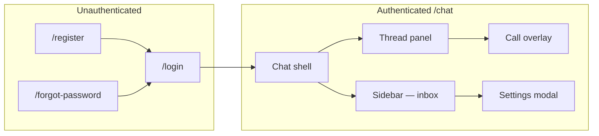
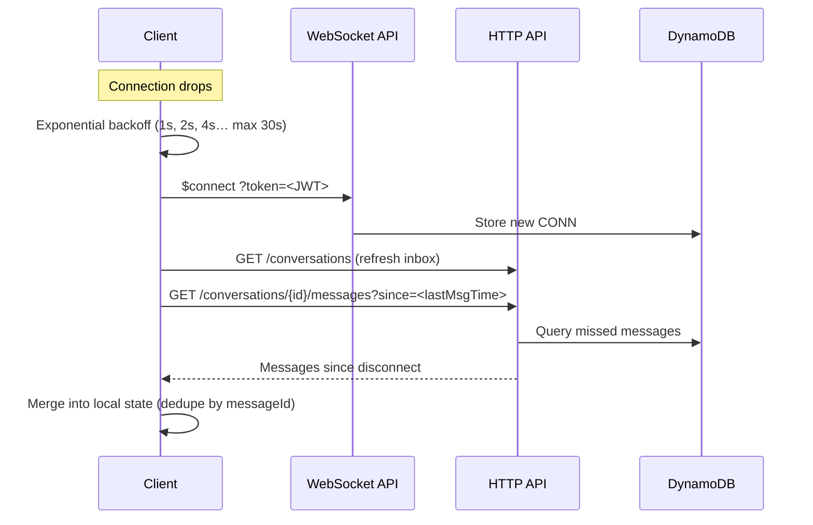
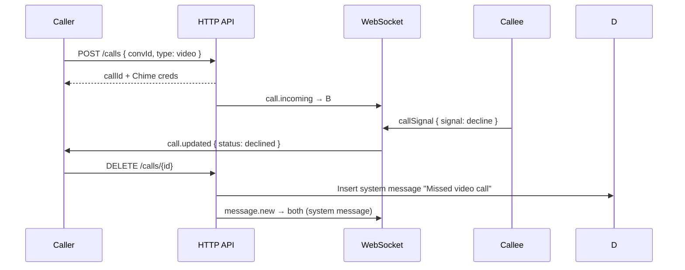

# Phase 3 — Design

**Project:** AmioChat  
**Version:** 0.2  
**Last updated:** 2026-06-16  
**Status:** Approved — ready for Phase 4 (Implementation)  
**Prerequisites:** [Phase 1](./phase-1-requirements.md) · [Phase 2](./phase-2-architecture.md)

---

## 1. Overview

Phase 3 turns the architecture into **implementable specifications**: UI layout, API contracts, data schemas, auth configuration, and security rules. Implementation (Phase 4) should follow these documents.

### Deliverables


| Document           | Path                                                           | Contents                           |
| ------------------ | -------------------------------------------------------------- | ---------------------------------- |
| REST API           | [design/openapi.yaml](./design/openapi.yaml)                   | OpenAPI 3.1 — all HTTP endpoints   |
| WebSocket protocol | [design/websocket-protocol.md](./design/websocket-protocol.md) | Actions, events, errors, reconnect |
| DynamoDB schema    | [design/dynamodb-schema.md](./design/dynamodb-schema.md)       | Attributes, indexes, example items |
| Security model     | [design/security-model.md](./design/security-model.md)         | Tokens, CORS, IAM, validation      |
| UI wireframes      | §2 below                                                       | Screen layout and component map    |


---

## 2. UI design (WhatsApp Web layout)

### 2.1 Design principles

- **Familiar:** Sidebar + chat panel pattern (UX-01)
- **Desktop-first:** Min width 1024px optimized; collapses to single-panel on mobile (< 768px)
- **Accessible:** Focus traps in modals; `aria-live` for new messages; visible focus rings (UX-03, UX-04)

### 2.2 Color & theme (MVP)


| Token               | Light mode | Usage                                    |
| ------------------- | ---------- | ---------------------------------------- |
| `--bg-app`          | `#f0f2f5`  | Page background                          |
| `--bg-sidebar`      | `#ffffff`  | Conversation list                        |
| `--bg-chat`         | `#efeae2`  | Chat wallpaper (subtle pattern optional) |
| `--bubble-sent`     | `#d9fdd3`  | Outgoing messages                        |
| `--bubble-received` | `#ffffff`  | Incoming messages                        |
| `--accent`          | `#00a884`  | Primary actions, online indicator        |
| `--text-primary`    | `#111b21`  | Body text                                |


Dark mode deferred to v1.x.

### 2.3 Screen map




### 2.4 Chat shell wireframe (desktop)

```
┌──────────────────────────────────────────────────────────────────────────┐
│ AmioChat                                                          [⚙]   │
├─────────────────────┬────────────────────────────────────────────────────┤
│ [Search contacts…]  │  ┌─ Header ─────────────────────────────────────┐  │
│                     │  │ [Avatar] Contact Name    online ●  [📞] [📹] │  │
│ ┌─ Conv item ─────┐ │  └──────────────────────────────────────────────┘  │
│ │[av] Alice       │ │                                                    │
│ │ Hey, are you…  ●2│ │  ┌──────────────────────────────────────────────┐  │
│ │         12:30 PM │ │  │         Today                                 │  │
│ └─────────────────┘ │  │  ┌──────────────────┐                        │  │
│ ┌─ Conv item ─────┐ │  │  │ Hi there!        │  10:02 ✓✓               │  │
│ │[av] Bob         │ │  │  └──────────────────┘                        │  │
│ │ See you soon     │ │  │                        ┌──────────────────┐ │  │
│ │         Yesterday│ │  │           10:05 ✓✓  │ I'm good, thanks │ │  │
│ └─────────────────┘ │  │                        └──────────────────┘ │  │
│                     │  │  Alice is typing…                             │  │
│ [+] New chat        │  └──────────────────────────────────────────────┘  │
│                     │  ┌─ Composer ───────────────────────────────────┐  │
│                     │  │ [📎] [ Type a message…              ] [Send] │  │
│                     │  └──────────────────────────────────────────────┘  │
└─────────────────────┴────────────────────────────────────────────────────┘
```

### 2.5 Component tree (Next.js)

```
app/
├── (auth)/
│   ├── login/page.tsx
│   ├── register/page.tsx
│   └── forgot-password/page.tsx
└── (chat)/
    ├── layout.tsx              # Auth guard, WebSocket provider
    └── page.tsx                # Chat shell
components/
├── auth/
│   ├── LoginForm.tsx
│   └── RegisterForm.tsx
├── chat/
│   ├── Sidebar.tsx
│   ├── ConversationList.tsx
│   ├── ConversationItem.tsx
│   ├── ChatHeader.tsx
│   ├── MessageList.tsx
│   ├── MessageBubble.tsx
│   ├── TypingIndicator.tsx
│   ├── Composer.tsx
│   ├── NewChatModal.tsx
│   └── CallOverlay.tsx
└── ui/
    ├── Avatar.tsx
    ├── Button.tsx
    └── Modal.tsx
```

### 2.6 Key UI states


| State                    | Behavior                                                  |
| ------------------------ | --------------------------------------------------------- |
| Empty inbox              | Illustration + “Start a new chat” CTA                     |
| No conversation selected | “Select a chat to start messaging” in thread panel        |
| Message sending          | Optimistic bubble with clock icon; replace with ✓ on ack  |
| Message delivered        | Single ✓                                                  |
| Message read             | Double ✓ (blue)                                           |
| Offline                  | Banner: “Connecting…”; queue outbound messages            |
| Incoming call            | Full-screen overlay with Accept / Decline                 |
| Active call              | Picture-in-picture local video; mute, camera, end buttons |


---

## 3. Amazon Cognito configuration

### 3.1 User Pool settings


| Setting            | Value                                             |
| ------------------ | ------------------------------------------------- |
| Pool name          | `amiochat-users-{env}`                            |
| Sign-in aliases    | Email only                                        |
| Username           | Email as username                                 |
| MFA                | Off (MVP)                                         |
| Email verification | Required                                          |
| Password policy    | Min 8 chars; require lowercase, uppercase, number |
| Account recovery   | Email only                                        |
| Advanced security  | Off (MVP); enable for prod hardening later        |


### 3.2 App Client settings


| Setting              | Value                                                       |
| -------------------- | ----------------------------------------------------------- |
| Client name          | `amiochat-web-{env}`                                        |
| Client secret        | None (public SPA client)                                    |
| Auth flows           | `ALLOW_USER_PASSWORD_AUTH`, `ALLOW_REFRESH_TOKEN_AUTH`      |
| ID token expiry      | 1 hour                                                      |
| Refresh token expiry | 30 days                                                     |
| OAuth                | Not used in MVP (direct username/password via Amplify Auth) |
| Callback URLs        | `https://{amplify-domain}/login` (per env)                  |
| Logout URLs          | `https://{amplify-domain}/login`                            |


### 3.3 Post-confirmation Lambda trigger

On first verified sign-up, create DynamoDB profile:

```
Trigger: PostConfirmation_ConfirmSignUp
Action:  Put USER#<sub> / PROFILE { email, displayName, createdAt }
         Put GSI1 EMAIL#<email> / USER#<sub>
```

`sub` from Cognito JWT becomes `userId` throughout the system.

### 3.4 Custom attributes (optional MVP)


| Attribute      | Type   | Notes                                |
| -------------- | ------ | ------------------------------------ |
| `display_name` | String | Synced to DynamoDB on profile update |


Prefer DynamoDB as source of truth for profile; Cognito stores auth identifiers only.

---

## 4. Edge-case sequence diagrams

### 4.1 WebSocket reconnect




### 4.2 Duplicate browser tabs

- Each tab opens its own WebSocket → separate `CONN#` rows for same `userId`
- Server **fan-out** sends events to all connections for a user
- `read` and `typing` from any tab apply globally (last-write-wins for read cursor)
- Client uses `BroadcastChannel` or `localStorage` events to sync active conversation across tabs (optional enhancement)

### 4.3 Call declined




### 4.4 Callee offline during call

- `POST /calls` succeeds; `call.incoming` fails (no active connections)
- Call record status → `missed` after 30s ring timeout
- System message inserted in conversation
- Caller UI shows “No answer”

---

## 5. Shared TypeScript types (reference)

These types are shared between `packages/backend` and `apps/web`:

```typescript
type MessageType = 'text' | 'image' | 'file' | 'system';
type MessageStatus = 'sent' | 'delivered' | 'read';
type PresenceStatus = 'online' | 'offline' | 'away';
type CallType = 'voice' | 'video';
type CallStatus = 'ringing' | 'connected' | 'declined' | 'missed' | 'ended';

interface User {
  userId: string;
  email: string;
  displayName: string;
  avatarUrl?: string;
  presence?: PresenceStatus;
  lastSeenAt?: string;
}

interface Conversation {
  convId: string;
  participant: User;
  lastMessageAt: string;
  lastMessagePreview: string;
  unreadCount: number;
}

interface Message {
  messageId: string;
  convId: string;
  senderId: string;
  type: MessageType;
  body?: string;
  mediaKey?: string;
  mediaUrl?: string;
  status: MessageStatus;
  createdAt: string;
}

interface Call {
  callId: string;
  convId: string;
  callerId: string;
  calleeId: string;
  type: CallType;
  status: CallStatus;
  chimeMeetingId: string;
}
```

---

## 6. Phase 4 handoff

Implementation should proceed in this order:

1. **Monorepo scaffold** — `apps/web`, `packages/backend`, `infra/`
2. **Terraform modules** — Cognito, DynamoDB, S3, HTTP API, WebSocket API
3. **Auth flows** — register, login, PostConfirmation trigger
4. **REST APIs** — users, conversations, messages, media
5. **WebSocket handlers** — connect, sendMessage, typing, read
6. **Chat UI** — sidebar, thread, composer
7. **Chime integration** — call create/join, CallOverlay UI
8. **Polish** — notifications, error states, reconnect

---

## 7. Approval


| Role          | Name    | Date       | Sign-off |
| ------------- | ------- | ---------- | -------- |
| Product owner | Rishitr | 2026-06-16 | ☑        |
| Tech lead     | TBD     |            | ☐        |


---

## Revision history


| Version | Date       | Author       | Changes                            |
| ------- | ---------- | ------------ | ---------------------------------- |
| 0.1     | 2026-06-16 | SDLC Phase 3 | Initial design package             |
| 0.2     | 2026-06-16 | SDLC Phase 3 | Approved; ready for implementation |


